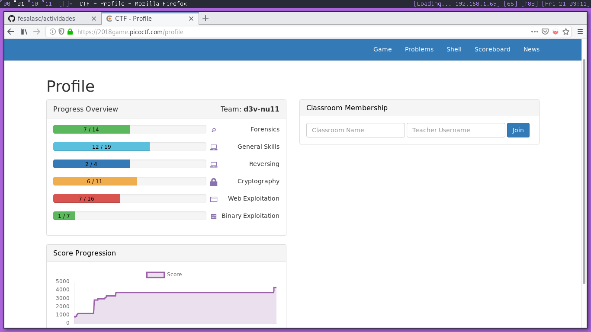

# Actividades

## Vista General

Fecha de entrega máxima: 28 Enero

Se deberán de llevar a cabo las siguientes actividades:

- __Mapeo__ de red. Es un escaneo de la red de tu hogar,  __no__ de alguna red
  pública (muchas redes abiertas tienen reglas o políticas, esto puede
  traer en algunos casos consecuencias legales), habrá que entrgar el `.nmap`
  o el archivo generado por el escaner que utilices.

- Análisis de tráfico. Es una exploración de los paquetes enviados/recibidos
  por los distintos equipos a los que se comunica determinado equipo mientras
  se está conectado a una red, todo esto mediante protocolos determinados. El
  archivo a entregar será el `.pcap` obtenido.

- Capture The Flag. Es un evento relacionado principalmente a temas de 
  __Hacking__, Seguridad de la Información y Ciencias de la Computación,
  existen dos modalidades:

  - **Jeopardy**, es un tipo de CTF donde se presentan varios retos, cada uno
  tiene un valor (puntaje), una vez resuelto el reto se entrega al equipo una
  _bandera_ (flag), la cual se intercambia por puntos, el equipo que logre
  resolver más retos (i.e. conseguir más puntos) será el ganador, usualmente se
  da un límite de tiempo. Las flags suelen ser cadenas de texto con un formato
  específico, por ejemplo: FLAG{c4d3na_4l34t0r1a}

  - **Ataque-Defensa**, otro tipo de CTF, aquí el objetivo es atacar y defender
  el activo dentro de una red, usualmente este tiene vulnerabilidades,
  las cuales deben de ser mitigadas y al mismo tiempo generar __ataques__
  (exploits) para vulnerar los activos de los otros equipos.

  Para esta actividad habrá que crear una cuenta en la URL
  [picococtf.com](https://picoctf.com), tendrás que intentar
  resolver **tantos** ejercicios como te sean posibles, si logras resolver
  **todo** el CTF será mejor.

Para cada actividad es necesario guardar la evidencia de que fueron llevadas
a cabo, por ejemplo, tomar capturas de pantalla legibles del procedimiento o
realizar un screencast de la actividad, así como guardar la salida de las
actividades en archivos de texto. En el caso del CTF, será útil generar un
archivo donde se guarde una pequeña explicación de cómo se resolvio el reto X,
de igual forma habrá que guardar la flag obtenida en ese archivo y por último,
tomar una captura de pantalla al tablero de puntos (scoreboard) de ser posible.

Si es de interés, puedes guardar tu progreso en un repositorio git, y
almacenarlo en algún servicio nube como:

- [Github](http://github.com)

- [Gitlab](http://gitlab.com)

- [Bitbucket](http://bitbucket.com)

> En caso de no completarlo se entenderá que __no__ deseas involucrarte
  en el laboratorio, dejándote fuera como aspirante o miembro
  _activo_ de tal.

Suerte. (;

---

## Detalles

### Mapeo de red

Se recomienda realizar esta actividad desde un SO GNU/Linux con la herramienta
`nmap`, como se especificó anteriormente se pueden tomar capturas de pantalla
al realizar ésta actividad, o en dado caso realizar un screencast de la
actividad (asegúrate que no sea muy largo el video), algo importante es guardar
la salida del comando en un archivo de texto, consulta el manual de `nmap` para
saber cómo hacer ésto, o en su defecto, tutoriales en internet.

Es importante que se muestren los servicios abiertos, cerrados y no filtrados
de los dispositivos conectados a la red.

 dejo la salida del escaneo que realicé en mi red.

### Análisis de tráfico

Para esta actividad será útil el uso de la herramienta `wireshark`, o en otro
caso, la herramienta `tcpdump`, puedes encontrar un mónton de información
acerca de estos en las páginas del manual o videos tutoriales en Youtube.
Es importante guardar la salida de alguna de las dos herramientas, como
punto de referencia intenta capturar al menos 100 paquetes de uno o varios
protocolos.

[Este tutorial](https://opensource.com/article/18/10/introduction-tcpdump)
de `tcpdump` servirá como una buena introducción al uso de la herramienta,
también te aconsejo leer el manual.

 dejo la salida del análisis de paquetes que 
realicé en mi red, no será de gran utilidad verla aquí, pues son datos crudos.

### Capture The Flag

En esta actividad será necesario crear una cuenta en la página del CTF:
[picoctf.com](http://picoctf.com)
Los retos planteados en este evento tienen un nivel suficientemente amigables
para personas que intentan aprender lo básico en seguridad computacional por
su cuenta propia, o en dado caso, con un equipo.

Tienes que resolver tantos ejercicios como te sea posible antes de la fecha de
entrega, así como guardar tu progreso en un archivo de texto (¡No MS Word!), es
decir escribir una pequeña descripción de cómo resolviste el reto e incluir la
flag que se te devolvió al completarlo.

Por ejemplo, este es un __write up__ de un participante del CTF del año pasado:

---

# PicoCTF_2017: Digital Camouflage

**Category:** Forensics
**Points:** 50
**Description:**

>We need to gain access to the school routers to cover our tracks. Let's try
and see if we can find the password in the network data we captured earlier:
**data.pcap**

**Hint:**

>It looks like an Administrator might have accessed the routers earlier. He had
to have logged in with his password. Where would log in data be located in a
network capture?

## Write-up
Looking up the `data.pcap` file in Wireshark lands us with packet #122

    HTML Form URL Encoded: application/x-www-form-urlencoded
        Form item: "userid" = "randled"
            Key: userid
            Value: randled
        Form item: "pswrd" = "OFBGRW8wdHRIUQ=="
            Key: pswrd
            Value: OFBGRW8wdHRIUQ==

Trying `OFBGRW8wdHRIUQ==` as the flag results in invalid... but wait, that
looks like base64!

    $ echo "OFBGRW8wdHRIUQ==" | base64 -d
    8PFEo0ttHQ

Therefore, the flag is `8PFEo0ttHQ`.

---

Como se mencionó, puedes guardar tus avances en un repositorio git que esté
en algún servicio como [Github](http://github.com), puedes encontrar un montón
de tutoriales acerca de cómo usar `git` en Youtube o buscando documentación
en la [página web de Git](http://git-scm.com)

Acá dejo la captura de pantalla del scoreboard, algunos de los _write-ups_
están alojados en el repositorio de la FES, si tienes cuenta en éste puedes
leerlos el el repositorio correspondiente.

